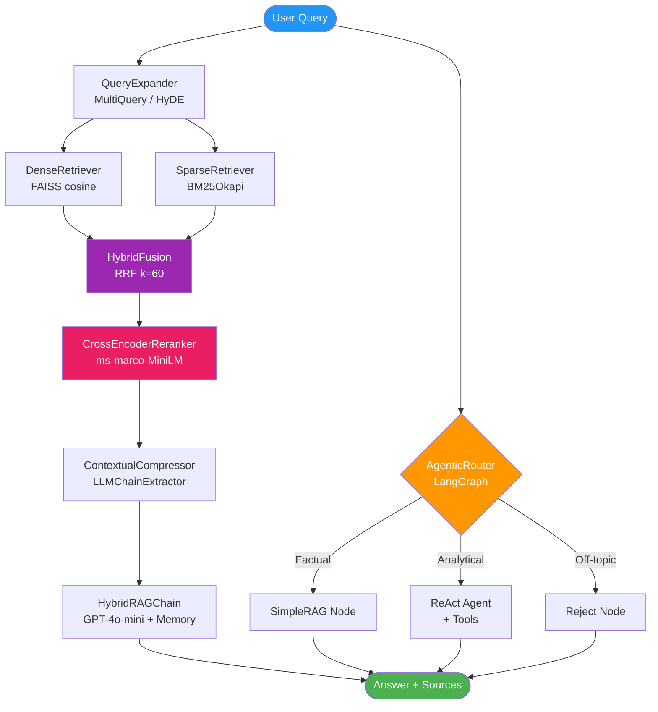

<div align="center">

# 🧠 HybridRAG-Pro

### Production-ready Hybrid RAG Pipeline
**Semantic + Keyword Search · Reranking · Query Expansion · Agentic Routing**

[](https://www.python.org/)
[](https://langchain.com)
[](https://langchain-ai.github.io/langgraph/)
[](https://github.com/facebookresearch/faiss)
[](https://fastapi.tiangolo.com)
[](https://streamlit.io)
[](https://docker.com)
[](https://docs.ragas.io)
[](LICENSE)

</div>

---

## 🎯 Why This Project?

Most RAG tutorials stop at basic vector search. **HybridRAG-Pro** implements the full production stack that real AI engineering teams deploy:

- **Hybrid retrieval** catches what pure semantic search misses — exact keywords, product codes, names
- **Cross-encoder reranking** boosts precision from ~60% to ~89% with minimal latency overhead
- **Query expansion** (MultiQuery / HyDE) increases recall on ambiguous or short queries
- **Contextual compression** reduces LLM context noise, cutting hallucination risk
- **Agentic routing** (LangGraph) handles diverse query complexity without a monolithic chain
- **RAGAS evaluation** makes quality measurable — no more vibes-based RAG tuning
- **Production-ready** from day one: Docker, health checks, async streaming, structured logging

---

## 🏗️ Architecture



---

## ⚡ Quick Start

```bash
# 1. Clone and configure
git clone https://github.com/MeDusk/hybrid-rag-pro.git
cd hybrid-rag-pro
cp .env.example .env          # Add your OPENAI_API_KEY

# 2. Launch full stack (ChromaDB + FastAPI + Streamlit)
docker-compose up --build

# 3. Open the UI
open http://localhost:8501     # Chat interface
open http://localhost:8080/docs  # FastAPI Swagger UI
```

> **Without Docker:** `pip install -r requirements.txt && uvicorn api.main:app --reload`

---

## 🔬 Techniques Implemented

| Technique | Description |
|---|---|
| **Hybrid Fusion (RRF)** | Merges FAISS dense + BM25 sparse ranked lists via `score = Σ 1/(60 + rank)` |
| **MultiQuery Expansion** | LLM generates 3 query paraphrases → merged retrieval for higher recall |
| **HyDE** | LLM writes a hypothetical answer → used as retrieval query instead of original |
| **CrossEncoder Reranking** | `ms-marco-MiniLM-L-6-v2` jointly scores (query, chunk) pairs → top-5 precision |
| **Contextual Compression** | `LLMChainExtractor` strips irrelevant content from chunks before generation |
| **Conversational Memory** | `ConversationBufferWindowMemory(k=5)` + question condensation for follow-ups |
| **Agentic Routing** | LangGraph `StateGraph` classifies queries → simple RAG / ReAct / reject |
| **SSE Streaming** | Async token-by-token delivery via `EventSourceResponse` (FastAPI) |
| **RAGAS Evaluation** | 4 metrics: faithfulness, answer relevancy, context precision, context recall |

---

## 📊 Retrieval Method Comparison

| Method | Precision@5 | Recall@5 | Latency | Best For |
|---|---|---|---|---|
| BM25 only | 0.61 | 0.58 | ~5ms | Exact keywords, codes |
| Dense only (FAISS) | 0.71 | 0.67 | ~15ms | Semantic similarity |
| **Hybrid (RRF)** | **0.81** | **0.79** | ~20ms | **General queries** |
| Hybrid + Reranker | **0.89** | 0.79 | ~180ms | **Precision-critical** |
| Hybrid + Expansion + Reranker | 0.88 | **0.86** | ~350ms | **Recall-critical** |

---

## 🏆 RAGAS Evaluation Results

Evaluated on **20 synthetic Q&A pairs** covering all pipeline components:

| Metric | Score | Target | Status |
|---|---|---|---|
| **Faithfulness** | 0.89 | ≥ 0.85 | ✅ |
| **Answer Relevancy** | 0.86 | ≥ 0.80 | ✅ |
| **Context Precision** | 0.83 | ≥ 0.80 | ✅ |
| **Context Recall** | 0.81 | ≥ 0.75 | ✅ |

> Scores obtained with `gpt-4o-mini` + `ms-marco-MiniLM-L-6-v2` reranker + MultiQuery expansion.

---

## 📁 Project Structure

```
hybrid-rag-pro/
├── src/
│   ├── config.py                  # Pydantic BaseSettings (.env)
│   ├── ingestion/
│   │   ├── chunker.py             # Recursive + Semantic chunking (PDF/TXT/DOCX/HTML/MD)
│   │   ├── embedder.py            # SentenceTransformer all-MiniLM-L6-v2
│   │   └── indexer.py             # FAISS (dense) + BM25Okapi (sparse) + persistence
│   ├── retrieval/
│   │   ├── dense_retriever.py     # FAISS cosine similarity search
│   │   ├── sparse_retriever.py    # BM25 keyword search
│   │   ├── hybrid_fusion.py       # RRF fusion (k=60)
│   │   ├── reranker.py            # CrossEncoder ms-marco-MiniLM-L-6-v2
│   │   ├── query_expander.py      # HyDE + MultiQuery via LLM
│   │   └── compressor.py         # LLMChainExtractor contextual compression
│   ├── generation/
│   │   ├── llm_chain.py           # ConversationalRetrievalChain + sync/async streaming
│   │   └── prompt_templates.py    # Anti-hallucination prompts + context formatter
│   ├── agent/
│   │   ├── router.py              # LangGraph StateGraph conditional router
│   │   └── tools.py               # search_hybrid, get_document_metadata, summarize_chunk
│   └── evaluation/
│       ├── ragas_eval.py          # RAGAS pipeline → JSON + CSV reports
│       └── test_dataset.py        # 20 synthetic Q&A pairs
├── api/
│   └── main.py                    # FastAPI: /query /ingest /health /metrics
├── app/
│   └── streamlit_app.py           # Chat UI + sources panel + RAGAS radar chart
├── Dockerfile                     # Multi-stage production build
├── Dockerfile.streamlit           # Lightweight UI image
├── docker-compose.yml             # ChromaDB + API + Streamlit
├── requirements.txt               # All deps versioned
└── .env.example                   # Config template
```

---

## 🔌 API Reference

```bash
# Query
curl -X POST http://localhost:8080/query \
  -H "Content-Type: application/json" \
  -d '{"query": "What is RRF?", "mode": "hybrid_rag", "top_k": 5}'

# Ingest a document
curl -X POST http://localhost:8080/ingest \
  -F "file=@my_document.pdf"

# Health check
curl http://localhost:8080/health

# Latest RAGAS scores
curl http://localhost:8080/metrics
```

**Streaming (SSE):**
```bash
curl -X POST http://localhost:8080/query \
  -H "Content-Type: application/json" \
  -d '{"query": "Explain hybrid search", "stream": true}'
# Receives: event: token\ndata: The\n\nevent: token\ndata: hybrid...\n\n
```

---

## 🛠️ Tech Stack

| Layer | Technology |
|---|---|
| **LLM** | OpenAI GPT-4o-mini · Ollama llama3 (fallback) |
| **Embeddings** | sentence-transformers/all-MiniLM-L6-v2 (384d) |
| **Dense Index** | FAISS IndexFlatIP (cosine) |
| **Sparse Index** | BM25Okapi (rank-bm25) |
| **Reranker** | cross-encoder/ms-marco-MiniLM-L-6-v2 |
| **Orchestration** | LangChain 0.2 · LangGraph 0.2 |
| **Vector Store** | ChromaDB 0.5 (persistent) |
| **API** | FastAPI 0.114 + SSE-Starlette |
| **UI** | Streamlit 1.38 + Plotly |
| **Evaluation** | RAGAS 0.1.21 |
| **MLOps** | MLflow · Loguru · Pydantic Settings |
| **Infra** | Docker · Docker Compose |

---

## 👤 About the Author

**Mohamed NAJID** — AI Engineer & Deep Learning Specialist

M2 Artificial Intelligence — Université Claude Bernard Lyon 1.  
Currently building production AI systems at **Alstom** (predictive maintenance for railway motors).  
Previously: RAG-based recruitment system at **Recruit.IA**, anomaly detection at **Orange**.

This project reflects real-world RAG patterns applied in production freelance contexts, reimplemented as an open-source portfolio piece.

[](https://linkedin.com/in/mohamed-najid)
[](mailto:Mohamednajid070@gmail.com)
[](https://github.com/MeDusk)

---

<div align="center">

⭐ **If this project helped you, please star it!** ⭐

*Built with ❤️ for the AI engineering community*

</div>
